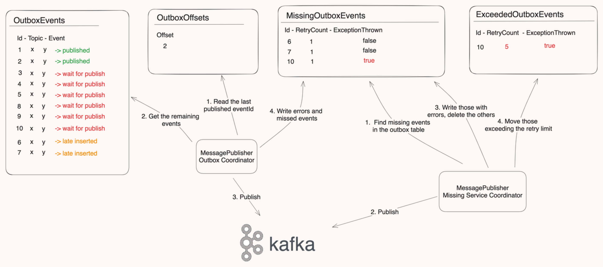

# PollingOutboxPublisher

## Contents

- [Description](#description)
- [Getting Started](#getting-started)
    - [Prerequisites](#prerequisites)
    - [Installation](#installation)
- [Usage](#usage)
    - [Algorithm](#algorithm)
    - [Multiple Instances](#multiple-instances)
- [Configuration](#configuration)
- [Example](#example)
- [License](#license)
- [Contributing](#contributing)
- [Contributors](#contributors)

## Description

- Polling Outbox Publisher is an outbox implementation for distributed systems. It uses an outbox algorithm and async
  transactions
  to ensure that no events are lost during processing.
- This application uses a straightforward approach where it periodically checks for new messages and publishes them in
  groups to the Kafka cluster. It deliberately avoids more complex data transfer technologies like Debezium Change Data
  Capture (CDC) or Couchbase Data Change Protocol (DCP). While those options might offer better performance and
  efficiency, this application prioritizes simplicity, ease of use, and maintaining independence from other systems.
- It also supports multiple instances to increase the reliability of the system.

## Getting Started

### Prerequisites

- .NET 8.0 or higher
- SQL Server 2016 or higher
- Redis 5.0 or higher
- Kafka 2.5 or higher

### Installation

1. Clone the repository

```bash
git clone https://github.com/Trendyol/PollingOutboxPublisher.git
```

2. Open the project in a IDE of your choice.
3. Add the config file (`/src/config/config.json`) and secret file (`/src/config/secret.json`).
5. Set as `0` the first row in the `OutboxOffset`.
4. Run the project.
6. The project will start the publish messages in the `OutboxEvents` data store.
7. That's it! You're ready to go!

## Usage

### Datastores

- The application can be use **Couchbase**, **PostgreSQL** or **MSSQL** as a data store.
- Each data store has its own implementation and corresponding repository.
- Each data store is corresponding to a table in the database or a bucket in the Couchbase.
- The application uses four different data stores to manage the messages.
    1. `OutboxEvents`: The data store that holds the messages to be published.
    2. `MissingEvents`: The data store that holds the messages that could not be published.
    3. `ExceededEvents`: The data store that holds the messages that could not be published after the retry limit is
       reached.
    4. `OutboxOffset`: The data store that holds the last published `OutboxEvents` ID.
- The scritps for creating data stores can be found under
  examples](https://github.com/Trendyol/PollingOutboxPublisher/tree/master/examples) folder

### Algorithm

1. The application will start getting the next batch of messages from the `OutboxEvents` data store.
2. Then, it will publish the messages in parallel to the Kafka cluster.
3. If an error occurs during the publishing process, the application will move the messages to `MissingEvents`
   and retry the publishing messages in batches.
    * When getting batch of event from `OutboxEvents` incremental ID list expected to be continuous. If there
      is a gap in the ID list, the application will move the messages to the `MissingEvents` and retry the
      publishing messages in batches.
4. If the retry limit is reached, the application will move the message to the `ExceededEvents`.
5. If the batch of messages is successfully published, the application will update the `OutboxOffset` with the
   last message id.
6. The application will continue to publish messages from the last message id in the `OutboxEvents` data store.
7. If the application is stopped, it will continue from the last message id in the `OutboxOffset` data store.

_You can see some basic diagrams below to summarize the algorithm:_


### Multiple Instances

Multiple instances of the application can be run at the same time to increase the reliability of the system. But, only
one instance should be the **Master Pod** at a time.
`MasterPodLock` is a distributed lock that is used to determine the **Master Pod**, and It has a TTL(time-to-live
value).

1. The first instance that take the `MasterPodLock` will be the **Master Pod** and will start publishing messages.
    * `MasterPodLock` is a simple redis key. If lock taken, the value of the key is setted as pod name which is getting
      from Environment value. If Environment doesn't have pod name, GUID is used.
3. The rest of the instances will be **Follower Pods** and will try to take the `MasterPodLock` every certain amount of
   time.
4. Also, the **Master Pod** will try to extend the `MasterPodLock` every certain amount of time.
5. If the **Master Pod** fails, the one of the **Follower Pods** will take the `MasterPodLock` and become the new
   **Master Pod**.
6. This feature can be disabled by setting the `MasterPodSettings.IsActive` to `false`, **but don't forget to make sure
   that only one instance is running at a time.**

> [!WARNING]
> If there will be multiple instances, the `MasterPodSettings.IsActive` should be set to `true`. Otherwise, messages can
> be duplicated or not published.

### Circuit Breaker

The application uses circuit breakers to handle database operation failures gracefully. Each daemon (OutboxEventsDaemon and MissingEventsDaemon) has its own circuit breaker that:

1. Opens after `Threshold` consecutive database failures (default: 3)
2. Stays open for `DurationSc` (default: 600 seconds)
3. Allows `HalfOpenMaxAttempts` (default: 1) operations when half-open
4. Automatically closes if operations succeed in half-open state

## Configuration

The application can be configured using the `config.json` and `secret.json` files. Here are the configurations you can
set:

## Important Notes

> [!WARNING]
> The default values for `Kafka.SaslMechanism` and `Kafka.SecurityProtocol` have been removed in version 1.3.0. Please
> ensure to set these values in your configuration to avoid any issues.

| **Key**                                      | **Type** | **Description**                                                                                                                                                    |
|----------------------------------------------|----------|--------------------------------------------------------------------------------------------------------------------------------------------------------------------|
| `Kafka.ReloadOnChange`                       | bool     | The flag indicating whether the Kafka configuration should be reloaded when the configuration file changes.                                                        |
| `Kafka.SaslUsername`                         | string   | The username for the SASL authentication of the Kafka cluster.                                                                                                     |
| `Kafka.Brokers`                              | string   | The addresses of the Kafka brokers.                                                                                                                                |
| `Kafka.SaslPassword`                         | string   | The password for the SASL authentication of the Kafka cluster.                                                                                                     |
| `Kafka.SslCaLocation`                        | string   | The location of the SSL certificate for the Kafka cluster.                                                                                                         |
| `Kafka.SslKeystorePassword`                  | string   | The SSL Keystore Password                                                                                                                                          |
| `Kafka.SaslMechanism`                        | string   | The SSL Mechanism.                                                                                                                                                 |
| `Kafka.SecurityProtocol`                     | string   | The SSL Protocol.                                                                                                                                                  |
| `Kafka.BatchSize`                            | string   | The Batch Size of the Kafka Publisher. **Default: 512 * 1024**                                                                                                     |
| `Kafka.LingerMs`                             | string   | The Linger of the Kafka Publisher. **Default: 10**                                                                                                                 |
| `Kafka.CompressionType`                      | string   | The Compression Type of the Kafka Publisher. **Default: Snappy**                                                                                                   |
| `Kafka.MessageMaxBytes`                      | string   | The Message Max Bytes of the Kafka Publisher. **Default: 30000000**                                                                                                |
| `Kafka.Acks`                                 | string   | The Acks of the Kafka Publisher  **Default: Leader**                                                                                                               |
| `BenchMarkOptions.IsPublishingOn`            | bool     | A flag indicating whether publishing is on. Can be used when load testing.                                                                                         |
| `WorkerSettings.OutboxEventsBatchSize`       | int      | The batch size for outbox events. The amount of messages is published in paralells.                                                                                |
| `WorkerSettings.QueueWaitDuration`           | int      | The wait duration for to take next batch of messages.                                                                                                              |
| `WorkerSettings.MissingEventsBatchSize`      | int      | The batch size for missing events. The amount of missing messages is published in paralells.                                                                       |
| `WorkerSettings.MissingEventsWaitDuration`   | int      | The wait duration to take next batch of missing events.                                                                                                            |
| `WorkerSettings.MissingEventsMaxRetryCount`  | int      | The maximum retry count for missing events.                                                                                                                        |
| `WorkerSettings.BrokerErrorsMaxRetryCount`   | int      | The maximum retry count for broker errors.                                                                                                                         |
| `WorkerSettings.RedeliveryDelayAfterError`   | int      | The delay after an error before redelivery the batch of missing events.                                                                                            |
| `ConnectionString`                           | string   | The connection string for the SQL database. It can be used for both MsSQL and PostgreSQL.                                                                          |
| `ReadOnlyConnectionString`                   | string   | The connection string for the **Readonly** SQL database. <br/> This config is optional and only work for MsSQL. If doesn't provided ConnectionString will be used. |
| `Couchbase.Host`                             | string   | The hostname or IP address of the Couchbase server.                                                                                                                |
| `Couchbase.Username`                         | string   | The username for authentication with Couchbase.                                                                                                                    |
| `Couchbase.Bucket`                           | string   | The name of the Couchbase bucket to access data.                                                                                                                   |
| `Couchbase.Scope`                            | string   | The scope within the bucket to access data.                                                                                                                        |
| `Couchbase.Password`                         | string   | The password for authentication with Couchbase.                                                                                                                    |
| `DataStoreSettings.DatabaseType`             | string   | The chosen database type.  It can be **MSSQL**, **Couchbase** or **PostgreSQL**                                                                                    |
| `DataStoreSettings.OutboxEvents`             | string   | The name of the outbox event data store.                                                                                                                           |
| `DataStoreSettings.MissingEvents`            | string   | The name of the missing event data store.                                                                                                                          |
| `DataStoreSettings.ExceededEvents`           | string   | The name of the exceeded event data store.                                                                                                                         |
| `DataStoreSettings.OutboxOffset`             | string   | The name of the outbox offset data store. Holds the last published `OutboxEvents` Id                                                                               |
| `MasterPodSettings.IsActive`                 | bool     | A flag indicating whether the master pod checker is active. Should be active if multiple pods is using.                                                            |
| `MasterPodSettings.CacheName`                | string   | The name of the distributed lock key. This key should be same for the multiple instances of the app.                                                               |
| `MasterPodSettings.MasterPodLifetime`        | int      | The lifetime of the master pod. The TTL of the distributed lock.                                                                                                   |
| `MasterPodSettings.MasterPodRaceInterval`    | int      | The interval to take `MasterPodLock` for **MasterPod** and **FollowerPods**.                                                                                       |
| `MasterPodSettings.IsMasterPodCheckInterval` | int      | The check interval for the `FollowerPods`. The check without intervals causes high CPU usage; because of that, this is needed.                                     |
| `Redis.Endpoints`                            | string   | The endpoints for the Redis instance.                                                                                                                              |
| `Redis.DefaultDatabase`                      | int      | The default database for the Redis instance.                                                                                                                       |
| `Redis.Config`                               | string   | The configuration for the Redis instance.                                                                                                                          |
| `Redis.Password`                             | string   | The password for the Redis instance.                                                                                                                               |
| `Serilog`                                    | object   | The configuration for Serilog.                                                                                                                                     |
| `CircuitBreakerSettings.IsEnabled`           | bool     | Enable/disable the circuit breaker feature. When enabled, protects against database operation failures.                                                            |
| `CircuitBreakerSettings.Threshold`           | int      | Number of consecutive database operation failures before the circuit breaker opens.                                                                                |
| `CircuitBreakerSettings.DurationSc`          | int      | Duration in seconds to keep the circuit breaker open before attempting to half-open.                                                                               |
| `CircuitBreakerSettings.HalfOpenMaxAttempts` | int      | Maximum number of attempts allowed when the circuit breaker is in half-open state.                                                                                 |

## EXAMPLE

In the [examples](https://github.com/Trendyol/PollingOutboxPublisher/tree/master/examples) folder, you'll find example
files for `config.json`, `secret.json`, and implementation on how to insert messages for each database type

> [!WARNING]
> For the Couchbase, incremental ID is used for the `OutboxEvents` data store. If you want to use the Couchbase, you
> should use a Counter for the ID. You can find the example code in the `CouchbaseExample` class.

## LICENSE

Released under the [MIT License](https://github.com/Trendyol/PollingOutboxPublisher/blob/master/LICENSE).

## CONTRIBUTING

See the [CONTRIBUTING](./CONTRIBUTING.md) file for details.

## CONTRIBUTORS

<a href="https://github.com/Trendyol/PollingOutboxPublisher/graphs/contributors">
  
</a>
